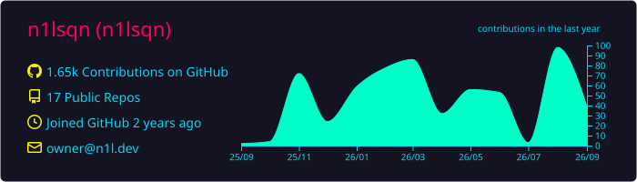
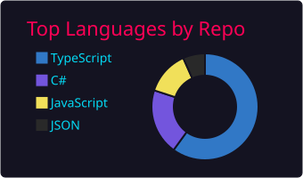
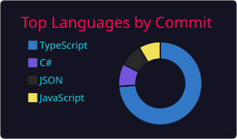
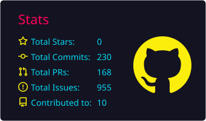
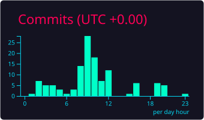

<div align="center">
   <h1>GitHub Profile Summary Cards</h1>

[English](/README.md) | [繁體中文](/docs/README_zh-tw.md) | [简体中文](/docs/README_zh-CN.md)

   <p>
      A tool to generate your github summary card for profile README. Inspired by <a href=https://github.com/tipsy/profile-summary-for-github>profile-summary-for-github</a>
   </p>
   <p>
      :star: This repo is just for fun, feel free to contribute! :star:
   </p>
   <p align="center">
      <a href="https://github.com/vn7n24fzkq/github-profile-summary-cards/stargazers">
      </a>
      <a href="https://github.com/vn7n24fzkq/github-profile-summary-cards/releases/latest">
      </a>
      <a href="https://www.conventionalcommits.org/en/v1.0.0/">
      </a>
      <a href="https://github.com/vn7n24fzkq/github-profile-summary-cards/actions/workflows/github-action.yml">
      </a>
   </p>
</div>

<div align="center">
<p>
<a href="https://github-profile-summary-cards.vercel.app/demo.html">Get your own cards now!!</a>
</p>
<p>
<a href="https://www.buymeacoffee.com/vn7n24fzkq" target="_blank" rel="noopener"></a>
</p>

<!-- Sample cards (mock data, `load` animation baked in). Regenerate with `npm run generate:preview`. -->


</div>

## Themes

|                                          |                                             |                                          |                                        |                                          |
| :--------------------------------------: | :-----------------------------------------: | :--------------------------------------: | :------------------------------------: | :--------------------------------------: |
|                 default                  |                    2077                     |                 dracula                  |                 github                 |               github_dark                |
|      |            |      |     |  |
|                 gruvbox                  |                   monokai                   |               nord_bright                |               nord_dark                |                 radical                  |
|      |         |  |  |      |
|                solarized                 |               solarized_dark                |                tokyonight                |                  vue                   |                 zenburn                  |
|    |  |   |        |      |
|               transparent                |                                             |                                          |                                        |                                          |
|  |                                             |                                          |                                        |                                          |

[More themes](https://github.com/vn7n24fzkq/github-profile-summary-cards-example/tree/master/profile-summary-card-output)

## How to use (API)

### Profile details card


`http://github-profile-summary-cards.vercel.app/api/cards/profile-details?username={username}&theme={theme_name}`

-   Accept url parameters
    -   theme
        -   Theme name
    -   username
        -   Username
    -   name
        -   Optional override for the displayed name/title (e.g. `name=Casper`). Defaults to `login (name)`; long values are elided to fit on one line (~22 chars).

### Top languages used in repository card


`http://github-profile-summary-cards.vercel.app/api/cards/repos-per-language?username={username}&theme={theme_name}&exclude={exclude}`

-   Accept url parameters
    -   theme
        -   Theme name
    -   username
        -   Username
    -   exclude:
        -   A comma separated list of languages to exclude, e.g., exclude=java,rust,jupyter%20Notebook
            -   You can represent a space in the language list by using '%20' when you want to include a space.
        -   You can found the supported languages in [here](https://github.com/github/linguist/blob/master/lib/linguist/languages.yml)
    -   exclude_repos:
        -   A comma separated list of repository names to exclude (case-insensitive), e.g., exclude_repos=dotfiles,my-fork
        -   `owner/repo` entries also match, e.g., exclude_repos=vn7n24fzkq/dotfiles

### Top languages in commits card


`http://github-profile-summary-cards.vercel.app/api/cards/most-commit-language?username={username}&theme={theme_name}&exclude={exclude}`

-   Accept url parameters
    -   theme
        -   Theme name
    -   username
        -   Username
    -   exclude:
        -   A comma separated list of languages to exclude, e.g., exclude=java,rust,jupyter%20Notebook
            -   You can represent a space in the language list by using '%20' when you want to include a space.
        -   You can found the supported languages in [here](https://github.com/github/linguist/blob/master/lib/linguist/languages.yml)
    -   exclude_repos:
        -   A comma separated list of repository names to exclude (case-insensitive), e.g., exclude_repos=dotfiles,my-fork
        -   Commits can come from other owners' repos, so `owner/repo` entries also match, e.g., exclude_repos=someorg/website

### GitHub stats card


`http://github-profile-summary-cards.vercel.app/api/cards/stats?username={username}&theme={theme_name}`

-   Accept url parameters
    -   theme
        -   Theme name
    -   username
        -   Username

### Productive time card


`http://github-profile-summary-cards.vercel.app/api/cards/productive-time?username={username}&theme={theme_name}&utcOffset={utcOffset}`

-   accept url parameters
    -   theme
    -   username
    -   utcOffset

### Custom colors

Every card endpoint also accepts these optional parameters to override individual colors of the selected `theme`:

`title_color`, `text_color`, `bg_color`, `border_color`, `icon_color`, `chart_color`

Values are hex **without** the leading `#` — 3, 4, 6, or 8 digits (the 4/8-digit forms include alpha). Anything else is ignored. For example, the `dark` theme with a transparent background:

`http://github-profile-summary-cards.vercel.app/api/cards/stats?username=vn7n24fzkq&theme=dark&bg_color=00000000`

Resolves [#110](https://github.com/vn7n24fzkq/github-profile-summary-cards/issues/110) and [#152](https://github.com/vn7n24fzkq/github-profile-summary-cards/issues/152).

The stats card also accepts `hide_logo=true` to remove the GitHub logo on the right:

`http://github-profile-summary-cards.vercel.app/api/cards/stats?username=vn7n24fzkq&theme=dark&hide_logo=true`

### Animations ✨ (new)

Cards can now **animate**! Add an optional `animation` parameter and the card plays a pure-CSS entrance when it loads — no GIFs, no JavaScript, works right inside your GitHub README. The background/frame appears instantly and the animation plays on the individual pieces (each stat row, each language, each bar), so it reads as the content filling into a ready card.

`none` (default) · `fade` · `rise` · `draw` · `stagger` · `load` · `sequence` · `tint` · `rgb` · `rgb-soft`

| Preset          | What it does                                                                                                                          |
| --------------- | ------------------------------------------------------------------------------------------------------------------------------------- |
| `fade` / `rise` | Content fades in (and gently slides up for `rise`).                                                                                   |
| `draw`          | Bars grow, donut segments pop, and the contributions line draws on.                                                                   |
| `stagger`       | Every piece fades in, one after another.                                                                                              |
| `load`          | A coordinated "loading → loaded" assembly: parts stagger in, then the charts draw on.                                                 |
| `sequence`      | Strict one-by-one reveal: title, each row, each language in order, then the line wipes in from the left along the time axis.          |
| `tint`          | Content fades in while its colours sweep from a shifted hue back to normal — a soft colour settle.                                    |
| `rgb`           | A continuous "gaming RGB" loop — the **whole card** (background included) cycles through the spectrum, rotating your theme's colours. |
| `rgb-soft`      | The same colour cycle, but **only the content** — the background keeps its theme colour.                                              |

```
https://github-profile-summary-cards.vercel.app/api/cards/stats?username=vn7n24fzkq&theme=default&animation=load
```

<!-- Baked-in animation previews (mock data). Regenerate with `npm run generate:preview`. -->


**Speed:** every preset has a sensible default. Add `duration` (in seconds, `0.2`–`10`) to make it faster or slower — it scales the whole thing, including the staggered/draw-on timing (for the `rgb` presets it's the colour-cycle period):

```
https://github-profile-summary-cards.vercel.app/api/cards/stats?username=vn7n24fzkq&theme=default&animation=load&duration=3
```

Any unrecognized `animation` value is treated as `none`, an invalid `duration` falls back to the preset default, and visitors with `prefers-reduced-motion` set always get the final, un-animated card.

#### 🌈 Feeling fancy? Turn on the RGB.

Give your profile that gaming-keyboard glow. `rgb-soft` cycles your card's colours forever while the background stays put:


```
https://github-profile-summary-cards.vercel.app/api/cards/profile-details?username=YOUR_NAME&theme=github_dark&animation=rgb-soft
```

Want the whole card — border and all — in on it? Use `animation=rgb`. Too much? Slow it right down with `&duration=10`. 😎

---

## Organization cards

All endpoints above accept either a user login or an organization login as `username`. The owner type is auto-detected; no extra parameter is needed.

The same URLs return organization-flavored cards when the login resolves to an organization:

-   `profile-details` swaps the contributions overlay for a "repos created over time" chart and shows Public Repos / Created at / Email|Location|Website.
-   `repos-per-language` and `most-commit-language` aggregate across the organization's public repos (top 50 for the commit card to stay within API rate limits).
-   `stats` shows Total Stars / Total Repos / Total Forks / Open Issues.
-   `productive-time` is **not supported** for organizations (it relies on per-user contribution data); the endpoint returns a small error card explaining this.

The same GitHub Action setup also works for organizations — set `USERNAME` to the org login. The generated `profile-summary-card-output/` will contain 4 cards per theme instead of 5.

> **Hosted API vs GitHub Action.** On the hosted API (`*.vercel.app`), the language and stats cards aggregate your **top 100 repositories by stars** — this keeps each request within the serverless time limit and light on the shared rate limit. The **GitHub Action** runs with your own token and no time limit, so it includes **all** of your repositories. (The total-repo count is exact either way.)

---

## Setting up your GitHub token

Every way of running this project — locally, in a GitHub Action, on Vercel — needs a GitHub personal access token (PAT). If you've never created one, read this section first.

### Who owns the token?

**A PAT always belongs to a user account, not to an organization.** Even when you point this tool at an organization (e.g. `microsoft`), the token comes from a _user_ — typically you. The token only grants whatever access _that user_ already has. For public data (which is what the cards display), any logged-in GitHub user can read it, so a token from any account works.

The cards only ever display **public** data, so a token from any user account can render any user or organization — you don't need to be a member of the org or grant any org-specific scope.

### Step 1: pick a token type

GitHub offers two PAT styles. Either works for this project.

-   **Fine-grained PAT** (recommended). Newer, scoped to specific repos or orgs, mandatory expiration.
    Create one at https://github.com/settings/personal-access-tokens/new.
-   **Classic PAT**. Older, broad scopes, optional expiration.
    Create one at https://github.com/settings/tokens/new.

### Step 2: grant the right permissions

For **public** users and orgs (the typical case), you need very little:

| Token type       | What to enable                                                                                                                                                                |
| ---------------- | ----------------------------------------------------------------------------------------------------------------------------------------------------------------------------- |
| Fine-grained PAT | **Repository access**: "Public repositories (read-only)". **Account permissions**: leave defaults — public profile and organization data are read without any explicit grant. |
| Classic PAT      | Check `public_repo` and `read:user`.                                                                                                                                          |

For **private** repos (to include private activity in your totals — see below), escalate:

| Token type       | What to enable                                                                               |
| ---------------- | -------------------------------------------------------------------------------------------- |
| Fine-grained PAT | "Repository access": "All repositories" or pick specific private repos. Read-only is enough. |
| Classic PAT      | Add `repo` (full repo access).                                                               |

Always set an expiration (90 days is a good default) and copy the token immediately — GitHub only shows it once.

### Step 3: put the token where it needs to go

Where the token lives depends on how you're running the tool. Same token, different home.

#### Local development (`npm run dev`, `npm run test:local`, or `vercel dev`)

Copy `.env.example` to `.env` in the repo root and paste the token in:

```env
GITHUB_TOKEN=your_github_token_here
```

`.env` is already in [.gitignore](.gitignore) — do not commit it. All of the commands below auto-load it.

Three ways to preview locally:

-   **`npm run dev`** — runs the real card handlers on a local server at `http://localhost:3000/` and live-reloads on save; type a user or org login to render every card. Best for iterating.
-   **`npm run test:local -- <login> [utcOffset] [exclude]`** — renders all cards for one login to `profile-summary-card-output/`.
-   **`vercel dev`** — full Vercel emulation of the API routes and the `/demo` page.

#### GitHub Actions (production card refresh on your profile repo)

Go to **the repo where the workflow will run** — typically `https://github.com/<your-username>/<your-username>` — and:

1. Click **Settings** → **Secrets and variables** → **Actions**.
2. Click **New repository secret**.
3. Name it `SUMMARY_GITHUB_TOKEN` (this is the name the example workflow below references).
4. Paste the token as the value and save.

The workflow file references the secret as `${{ secrets.SUMMARY_GITHUB_TOKEN }}`. Never paste the raw token into the YAML.

If you want the bot to push generated cards back to the repo, two options work:

-   **Built-in `GITHUB_TOKEN`** plus `permissions: contents: write` in the workflow (the `jobs.build` block in the example workflow below already includes this line). GitHub's auto-provided token has read-only permissions by default on many repos, so this `permissions:` line is what actually grants it push access for scheduled cron runs.
-   **Your own PAT** stored under a custom secret name such as `SUMMARY_GITHUB_TOKEN`. Useful if you'd rather not adjust workflow permissions, or if your repo's default workflow permissions are locked to read-only.

#### Vercel (your own deployment of the API)

In your Vercel project: **Settings** → **Environment Variables** → **Add**.

-   **Key**: `GITHUB_TOKEN`
-   **Value**: paste the token
-   **Environments**: check Production, Preview, and Development.

Redeploy after saving so the new env var takes effect.

### Common mistakes

-   **Committing the token.** If `.env` shows up in `git status`, stop — confirm it matches the entry in `.gitignore` before continuing. If you've already pushed a commit containing a token, revoke it at https://github.com/settings/tokens and create a new one.
-   **Using `${{ secrets.GITHUB_TOKEN }}` (the built-in token) without setting workflow permissions.** The auto-provided `GITHUB_TOKEN` is often read-only by default. If you want to use it for pushing, add `permissions: contents: write` to the workflow; otherwise switch to your own PAT under a custom secret name (e.g. `SUMMARY_GITHUB_TOKEN`).
-   **Token created under an org account.** Not a thing — GitHub doesn't issue PATs to orgs. Always create from your user `Settings → Developer settings`.

### Including private-repo activity without exposing repo names

The cards never render private repo names, titles, commit messages, or per-repo star counts — they only show aggregate numbers and language labels. So you can safely have your _totals_ reflect private-repo activity without leaking which repos exist. To enable this you need **both** a PAT with private read scope _and_ a GitHub profile setting:

1. **Scope the token to read private repos.**

    | Token type                     | What to enable                                                                                                                                                                                                                                                            |
    | ------------------------------ | ------------------------------------------------------------------------------------------------------------------------------------------------------------------------------------------------------------------------------------------------------------------------- |
    | Fine-grained PAT (recommended) | **Repository access**: pick the specific private repos you want counted (or "All repositories"). **Permissions**: `Contents: read`, `Issues: read`, `Pull requests: read`, `Metadata: read`. Whitelisting specific repos keeps the blast radius small if the token leaks. |
    | Classic PAT                    | `repo` + `read:user`. Add `read:org` if the private repos belong to an organization. Note that `repo` is broad — it grants read **and write** to every private repo your account can see; prefer Fine-grained whenever possible.                                          |

2. **Opt in to private contributions on your profile.** Visit https://github.com/settings/profile, scroll to **Contribution settings**, and check **"Include private contributions on my profile."** Without this toggle, `contributionsCollection` returns zero for private activity even with a fully-scoped token.

After both settings are in place, the following counts will include private-repo activity:

-   ✅ Stats: Total Commits, Total PRs, Total Issues
-   ✅ Profile Details: contribution chart (daily contribution counts in the area chart)
-   ✅ Repos Per Language donut
-   ✅ Most Commit Language donut
-   ✅ Productive Time heatmap

Two counters in the Stats / Profile Details cards stay **public-only by design** in the current code — `Total Stars` and `Contributed to`. Their GraphQL queries hard-code `privacy: PUBLIC` (see [src/github-api/profile-details.ts:55](src/github-api/profile-details.ts:55) and [:74](src/github-api/profile-details.ts:74)). If you want private-repo stars to roll up into the Stats card too, remove those filters or set up an opt-in env var — file an issue and we can scope a change.

**What the cards still don't expose.** Even with everything above enabled, the SVGs never include: repo names, repo descriptions or topics, per-repo star counts, commit messages, author emails, commit SHAs, or issue/PR titles. The worst-case inference from the public cards is something like "this account made N commits last year across mostly-TypeScript repos" — no specific private repo is identifiable.

---

## How to use (GitHub Actions)

This action generate your github profile summary cards and make a commit to your repo.
You can also trigger action by yourself after add this action.

:star: [Follow tutorial](https://github.com/vn7n24fzkq/github-profile-summary-cards/wiki/Tutorial) ( Recommendation ) :star:

#### First step

-   Create a Personal access token and add it as a repo secret named `SUMMARY_GITHUB_TOKEN`. If you've never done this, see [Setting up your GitHub token](#setting-up-your-github-token) above for a step-by-step walkthrough including required scopes and where the secret goes.
-   For additional context, the project's [wiki tutorial](https://github.com/vn7n24fzkq/github-profile-summary-cards/wiki/Tutorial#generate-token) covers the same ground with screenshots.

#### Use template ( create a repository )

-   [github-profile-summary-cards-example](https://github.com/vn7n24fzkq/github-profile-summary-cards-example)

-   Action already setup in this template, you just need click `use this template button` to create your profile readme.

-   After replace GITHUB_TOKEN with your repo secret and trigger action you can use everything in `profile-summary-card-output` folder.

#### Add to exist repository

-   Add this action to repo and replace GITHUB_TOKEN in action yml file with your repo secret.

---

## GitHub Actions usage

After the action finished. You can see all of summary cards are in folder which named `profile-summary-card-output`.

`Note: Some summary cards might not be updated in time, because github raw file has cache time.`

```yml
name: GitHub-Profile-Summary-Cards

on:
    schedule: # execute every 24 hours
        - cron: '* */24 * * *'
    workflow_dispatch:

jobs:
    build:
        runs-on: ubuntu-latest
        name: generate-github-profile-summary-cards
        permissions:
            contents: write

        steps:
            - uses: actions/checkout@v4
            - uses: vn7n24fzkq/github-profile-summary-cards@release
              env: # default use ${{ secrets.SUMMARY_GITHUB_TOKEN }}, you should replace with your personal access token
                  GITHUB_TOKEN: ${{ secrets.SUMMARY_GITHUB_TOKEN }}
              with:
                  USERNAME: ${{ github.repository_owner }}
                  # BRANCH_NAME is optional, default to main, branch name to push cards
                  BRANCH_NAME: 'main'
                  # UTC_OFFSET is optional, default to zero
                  UTC_OFFSET: 8
                  # EXCLUDE is an optional comma seperated list of languages to exclude, defaults to ""
                  EXCLUDE: ''
                  # AUTO_PUSH is optional, a boolean variable default to true, whether automatically push generated files to desired branch
                  AUTO_PUSH: true
                  # THEME is optional; set it to generate only that one theme (e.g. github_dark). Leave empty to generate every theme.
                  THEME: ''
                  # ANIMATION is optional; bake a CSS animation into the cards: none | fade | rise | draw | stagger | load | sequence | tint | rgb | rgb-soft. Empty = no animation.
                  ANIMATION: ''
                  # DURATION is optional; animation speed in seconds (0.2–10). Only applies when ANIMATION is set. Empty = preset default.
                  DURATION: ''
                  # NAME is optional; override the displayed name/title on the profile-details card (elided to ~22 chars). Empty = default "login (name)".
                  NAME: ''
```

`THEME` and `ANIMATION` are independent:

-   **neither** → every theme, no animation (the default, unchanged).
-   **`THEME` only** → just that theme, no animation.
-   **`ANIMATION` only** → every theme, each with that animation.
-   **both** → that one theme with that animation.

---

## Unified Profile Summary Cards (GitLab & Combined Support)

This repository supports generating profile summary cards from **GitLab** (both GitLab.com and self-hosted GitLab instances) as well as a **Combined** mode merging GitHub and GitLab activities into unified cards!

Supported modes:

1. `github`: GitHub only (default)
2. `gitlab`: GitLab only (GitLab.com or self-hosted)
3. `combined`: Aggregated GitHub + GitLab totals and activities

### 1. Generating via CLI

You can generate cards locally or in automated CI environments using `npm run generate`:

```bash
# GitLab-only generation
GITLAB_TOKEN="glpat-..." npm run generate -- \
  --provider=gitlab \
  --gitlab-username=your-gitlab-user \
  --gitlab-base-url=https://gitlab.example.com \
  --theme=2077

# Combined mode (GitHub + GitLab)
GITHUB_TOKEN="ghp_..." GITLAB_TOKEN="glpat-..." npm run generate -- \
  --provider=combined \
  --github-username=your-github-user \
  --gitlab-username=your-gitlab-user \
  --gitlab-base-url=https://gitlab.example.com \
  --theme=github_dark

# Dry run (validates configuration without API requests)
GITHUB_TOKEN="ghp_..." npm run generate -- --provider=github --github-username=user --dry-run
```

#### CLI Options & Environment Variables

| Option / Variable  | CLI Flag            | Env Var                  | Description                          | Default                       |
| ------------------ | ------------------- | ------------------------ | ------------------------------------ | ----------------------------- |
| Provider           | `--provider`        | `PROVIDER`               | `github`, `gitlab`, or `combined`    | `github`                      |
| GitHub Username    | `--github-username` | `GITHUB_USERNAME`        | GitHub user or org login             | -                             |
| GitHub Token       | _(Env only)_        | `GITHUB_TOKEN`           | GitHub PAT (Classic or Fine-grained) | -                             |
| GitLab Username    | `--gitlab-username` | `GITLAB_USERNAME`        | GitLab user login                    | -                             |
| GitLab Base URL    | `--gitlab-base-url` | `GITLAB_BASE_URL`        | Self-hosted GitLab URL               | `https://gitlab.com`          |
| GitLab Token       | _(Env only)_        | `GITLAB_TOKEN`           | GitLab PAT (`read_api` scope)        | -                             |
| Include Private    | `--include-private` | `GITLAB_INCLUDE_PRIVATE` | Count private GitLab project stats   | `false`                       |
| Output Directory   | `--output-dir`      | `OUTPUT_DIR`             | Directory to write cards             | `profile-summary-card-output` |
| Theme              | `--theme`           | `THEME`                  | Pinned theme (empty = all themes)    | All                           |
| Animation          | `--animation`       | `ANIMATION`              | CSS animation preset                 | None                          |
| Time Range Days    | `--time-range-days` | `TIME_RANGE_DAYS`        | Activity history lookback days       | `365`                         |
| UTC Offset         | `--utc-offset`      | `UTC_OFFSET`             | UTC offset in hours                  | `0`                           |
| Deduplication Mode | `--dedupe-mode`     | `DEDUPE_MODE`            | `none` or `repository-url`           | `none`                        |
| Avatar Source      | `--avatar-source`   | `AVATAR_SOURCE`          | `github`, `gitlab`, or `none`        | `gitlab`                      |

> **Security Note**: Access tokens (`GITHUB_TOKEN`, `GITLAB_TOKEN`) are **strictly prohibited** on the CLI argument list and must only be supplied via environment variables or `.env`.

---

### 2. Automated Refresh via GitLab CI/CD

A production-ready `.gitlab-ci.yml` is included in this repository.

#### Step 1: Configure CI/CD Variables

In your GitLab repository, navigate to **Settings → CI/CD → Variables** and add:

-   `GITLAB_TOKEN`: GitLab Personal Access Token or Project Access Token with `read_api` (and `read_user`) scope. Marked as **Masked** and **Protected**.
-   `GITLAB_USERNAME`: Your GitLab username.
-   `PROFILE_PUSH_TOKEN`: A Project Access Token or Personal Access Token with `write_repository` permission to push generated SVGs back to the branch.
-   _(Optional for Combined mode)_: `GITHUB_TOKEN` and `GITHUB_USERNAME`.
-   _(Optional for Self-hosted)_: `GITLAB_BASE_URL` (e.g. `https://gitlab.internal.domain`).

#### Step 2: Set Up Pipeline Schedule

Go to **Build → Pipeline schedules** in GitLab and create a daily schedule (e.g. `0 4 * * *` for 4:00 AM UTC).

#### Pipeline Features in `.gitlab-ci.yml`:

-   **Scheduled and Web triggers**: Runs on schedule or manual run from the GitLab Web UI.
-   **Node 22 Bookworm**: Built on `node:22-bookworm-slim`.
-   **Concurrency Control**: Protected by `resource_group: profile-card-generation` to avoid concurrent git push conflicts.
-   **Loop Prevention**: Commits using `chore: update profile summary cards [skip ci]` to prevent infinite CI loops.
-   **Artifacts**: Stores generated cards as job artifacts for 7 days.

---

### 3. Embedding Cards in GitLab Profile README

In GitLab, create a project with the same name as your username (e.g. `username/username`) and add a `README.md`. Embed your cards like this:

```markdown
### 📊 Activity & Stats

<div align="center">

<!-- 0. Profile Details Card -->

<br />

<!-- 1 & 2. Language Donut Charts -->


<br />

<!-- 3 & 4. Stats & Productive Time -->



</div>
```

_(Replace `2077` with your favorite theme: `default`, `github_dark`, `radical`, `tokyonight`, etc.)_

---

### 4. Privacy & Security Safeguards

-   **No Private Metadata Leakage**: Private repository names, project paths, descriptions, commit messages, and author names are **never** rendered into SVGs or written to `metadata.json`.
-   **Secret Masking**: All access tokens (`glpat-*`, `ghp_*`, `Bearer *`) are automatically masked (`***`) in stdout, stderr, and logs.
-   **Safe Aggregation**: Only aggregate counts (commits, PRs, issues, stars, language byte percentages) are displayed.

---

### 5. CLI Exit Codes

On failure, the generator exits with standard POSIX exit codes:

| Code | Status              | Meaning                                                           |
| :--: | ------------------- | ----------------------------------------------------------------- |
| `0`  | `SUCCESS`           | Cards generated successfully                                      |
| `2`  | `CONFIG_INVALID`    | Invalid CLI options, missing required env vars, or bad parameters |
| `3`  | `USER_NOT_FOUND`    | User not found on GitHub or GitLab                                |
| `4`  | `AUTH_FAILED`       | Invalid, expired, or rejected authentication token                |
| `5`  | `PERMISSION_DENIED` | Insufficient permissions for requested resources                  |
| `6`  | `RATE_LIMITED`      | API rate limit exceeded and retry budget exhausted                |
| `7`  | `API_UNAVAILABLE`   | Remote API returned 5xx errors or network connection failed       |
| `8`  | `PARTIAL_DATA`      | Partial failure when `FAIL_ON_PARTIAL_ERROR=true`                 |
| `9`  | `RENDER_FAILED`     | Internal error generating or rendering SVG templates              |

---

## Development (Devbox)

This project uses [devbox](https://www.jetify.com/devbox) to ensure a reproducible development environment (Node.js 22, Python 3).

### 1. Setup

```sh
# Install devbox
curl -fsSL https://get.jetpack.io/devbox | bash

# Enter shell (installs all dependencies automatically)
devbox shell
```

### 2. Local Testing

We provide a script to generate cards locally for visual verification.
**Prerequisite**: A `GITHUB_TOKEN`. If you've never created one, follow [Setting up your GitHub token](#setting-up-your-github-token) above — for local use, copy `.env.example` to `.env` and paste your token in.

```sh
# Generate cards for a user (defaults to vn7n24fzkq when no login is given)
npm run test:local -- vn7n24fzkq 8

# Generate cards for an organization (auto-detected)
npm run test:local -- microsoft 0

# Optional third arg: comma-separated languages to exclude
npm run test:local -- microsoft 0 java,jupyter%20notebook
```

Outputs are written to `profile-summary-card-output/<theme>/`. Open `profile-summary-card-output/default/README.md` to preview every card in the default theme. When you point this at an organization, the productive-time slot is replaced by `4-productive-time-unsupported.svg` so you can verify the explanatory error card the Vercel route would return.

**No token? Test the Action's output pipeline with mock data.** `npm run test:action` runs the exact generation flow the GitHub Action uses (theme filtering, animation, duration, name, preview markdown) against local fixtures — no token, no network. It honours the same knobs as the Action inputs, via env vars:

```sh
# One theme, sequence animation at 4s, custom title — writes profile-summary-card-output/github_dark/
THEME=github_dark ANIMATION=sequence DURATION=4 NAME="Casper" UTC_OFFSET=8 npm run test:action

# All themes, no animation (the Action's default)
npm run test:action
```

### 3. Run the API Locally

A lightweight local dev server is bundled — no Vercel CLI required:

```sh
npm run dev
# then open http://localhost:3000/
```

The dev server mounts the same route handlers used in production (`api/cards/*`), so requests like `http://localhost:3000/api/cards/profile-details?username=<login>&theme=<theme>` exercise the exact code path Vercel runs. The index page at `/` includes a form that renders every card for a given login + theme, plus a theme/animation picker and a **Replay** button to watch the entrance animation.

**No token? No problem.** When no `GITHUB_TOKEN` is set, the dev server automatically serves **mock cards** from local fixtures — no network calls — which is ideal for iterating on themes and animations. Add `&mock=1` to any card URL to force fixtures even when a token is present, or `&mock=0` to force live data.

If you'd rather use the real Vercel runtime (closer match to production behaviour but requires linking the repo to a Vercel project):

```sh
npm i -g vercel
vercel dev
```

## Deploy your own API on Vercel

Quickly deploy your own version!

[](https://vercel.com/new/clone?repository-url=https%3A%2F%2Fgithub.com%2Fvn7n24fzkq%2Fgithub-profile-summary-cards&env=GITHUB_TOKEN&envDescription=https%3A%2F%2Fgithub.com%2Fvn7n24fzkq%2Fgithub-profile-summary-cards%23first-step&project-name=my-github-profile-summary-cards)
